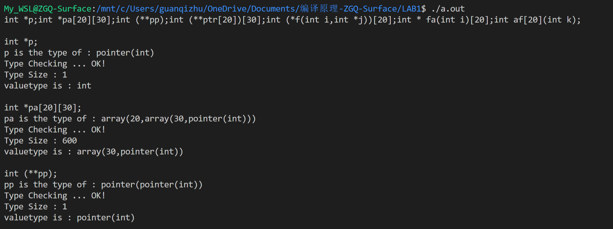
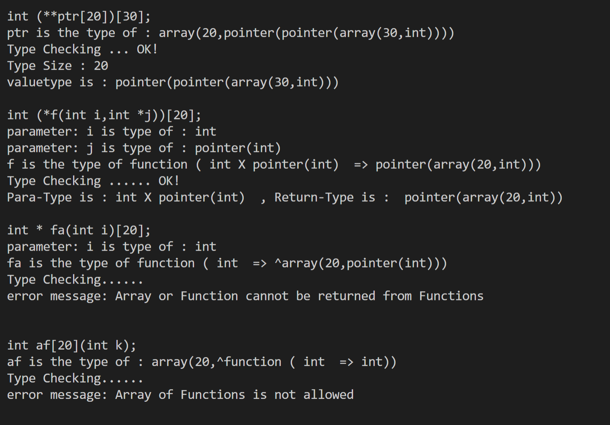
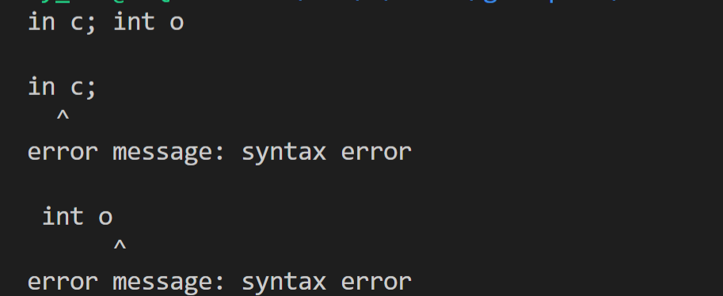
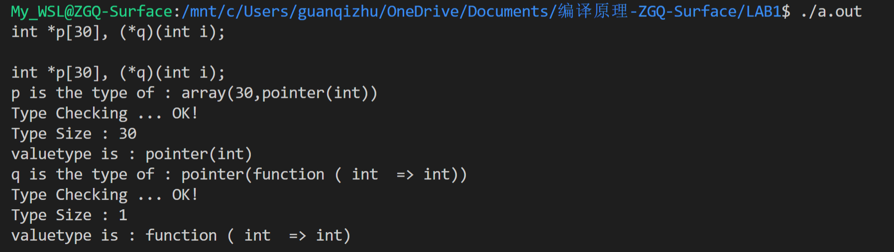
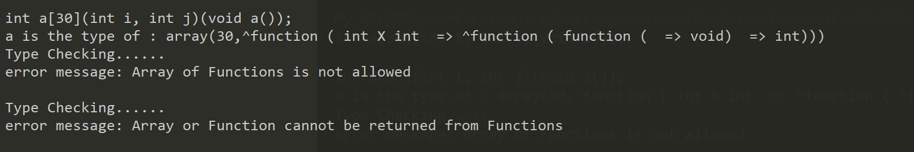

# Lab1 实验报告

## 组员

祝冠琪，王之玺，王海林

## **1.递归下降语法分析的程序设计**

为了能用递归下降的程序分析声明的文法，我们对原始的文法进行了修改，将左递归改成右递归，并使文法没有公共左因子。以下是经过修改的文法，在实际编程中，对于产生式左边的非终结符产生唯一的右边的非终结符时，我们将两个非终结符合并。若一个非终结符单纯由另一个非终结符并排组成，我们直接用一个while循环处理，而不增加新的非终结符。

```
translation_unit
: declaration translation_unit'
;

translation_unit'
: declaration translation_unit' 
| ε
;

declaration
: declaration_specifiers init_declarator_list ';'
;

declaration_specifiers
: type_specifier
;

init_declarator_list
: init_declarator init_declarator_list'
;
init_declarator_list'
: ',' init_declarator init_declarator_list'
| ε
;

init_declarator
: declarator
;

type_specifier
: VOID
| INT
;

declarator
: pointer direct_declarator
| direct_declarator
;

direct_declarator
: IDENTIFIER direct_declarator'
| '(' declarator ')' direct_declarator'
;

direct_declarator'
: '[' CONSTANT_INT ']' direct_declarator'
| '(' parameter_type_list ')' direct_declarator'
| '(' ')' direct_declarator'
| ε
;

pointer
: '*'
| '*' pointer
;
parameter_type_list
: parameter_list
;
parameter_list
: parameter_declaration parameter_list'
;

parameter_list'
: ',' parameter_declaration parameter_list'
| ε
;
parameter_declaration
: declaration_specifiers declarator
;
```


为了能最终输出每个id的类型信息，我们为每个id保存了如下信息：

```c++
class ID {
 public:
  string idname;
  string type;
  string oritype;
  string para_type[30];
  int t_size = 1;
  string levstr[10];
  int level = -1;
  int maxlev = -1;
  vector<int> error_flag;               // semantic error;
  vector<vector<class ID>> parameters;  // for function
};
```

type是id的最终输出信息字符串，oritype是原始的两个类型（int和void），para_type是函数的参数类型集合，t_size是type size。levstr是最初扫描字符串时，将每一层declaration的信息保存在对应的level中，以便最后trans函数能将这些信息转换成type。error_flag用于保存语义错误，parameters用于保存函数的参数表中每个变量的信息。


```c++
void getsym() {
  sym = "";
  if (s_index != decs[decs_cnt].length()) {
    while (decs[decs_cnt][s_index] == ' ' || decs[decs_cnt][s_index] == '\t') {
      s_index++;
    }
    if (isalpha(decs[decs_cnt][s_index])) {
      while (isalpha(decs[decs_cnt][s_index])) {
        sym += decs[decs_cnt][s_index];
        s_index++;
      }
    } else if (isdigit(decs[decs_cnt][s_index])) {
      while (isdigit(decs[decs_cnt][s_index])) {
        sym += decs[decs_cnt][s_index];
        s_index++;
      }
    } else {
      sym += decs[decs_cnt][s_index];
      s_index++;
    }
  }
  // cout << sym << endl;
}
```

 getsym函数是模仿pl0的getsym函数实现的，其功能是跳过空格和制表符，读取下一个符号。符号的意思是单个的'*', '(', ')', '[', ']' 符号，或者int, void, id和数字这些多个字符组成的符号。


```c++
void split(const string &input) {
  string str;
  for (auto it = input.begin(); it != input.end(); it++) {
    str += *it;
    if (*it == ';' || it == input.end() - 1) {
      decs.push_back(str);
      str.erase();
    }
  }
}
```

split函数将输入字符串以' ; ' 分开。


```c++
void translation_unit(vector<vector<ID>> &id_list) {
  vector<ID> idtab;
  declaration(idtab);
  if (!err_flag) {
    id_list.push_back(idtab);
  } else {
    decs_cnt++;
    s_index = 0;
    err_flag = false;
    err_pos = 0;
  }
  while (decs.begin() + decs_cnt != decs.end()) {
    getsym();
    idtab.clear();
    declaration(idtab);
    if (!err_flag) {
      id_list.push_back(idtab);
    } else {
      decs_cnt++;
      s_index = 0;
      err_flag = false;
      err_pos = 0;
    }
  }
}
```

translation函数是开始语法分析的第一个入口函数，将输入若干个以分号结尾的声明交给declaration函数处理。


```c++
void declaration(vector<ID> &idtab) {
  string oritype;
  declaration_specifiers(oritype);
  if (err_flag) return;
  init_declarator_list(idtab);
  if (err_flag) return;
  for (auto it = idtab.begin(); it != idtab.end(); it++) {
    it->oritype = oritype;
  }
  trans(idtab);
  if (sym == ";") {
    decs_no_syntax_error.push_back(decs[decs_cnt]);
    decs_cnt++;
    s_index = 0;
  } else {
    err_pos = s_index;
    error(-1);
    err_flag = true;
  }
}
```

declaration可以产生declaration_specifiers和init_declarator_list，并在这两个函数结束后将统一的int 或者 void传给每个id的oritype中。如果结尾是分号，则通过decs_cnt++使调用函数处理下一个declaration。如果不是分号则报错。trans函数负责将id表中所有的id的oritype和levstr的每个层次的字符串按照高增次有限输出的顺序存到type中，并计算出type size。


```c++
void declaration_specifiers(string &oritype) {
  if (sym == "int") {
    oritype = "int";
  } else if (sym == "void") {
    oritype = "void";
  } else {
    err_pos = s_index;
    error(-1);
    err_flag = true;
  }
  getsym();
}
```

此函数用于识别int 和 void，如果不是这两种情况则语法错误。


```c++
void init_declarator_list(vector<ID> &idtab) {
  class ID ID_1;
  init_declarator(ID_1);
  if (err_flag) return;
  idtab.push_back(ID_1);
  while (sym == ",") {
    getsym();
    init_declarator(ID_1);
    if (err_flag) return;
    idtab.push_back(ID_1);
  }
  return;
}
```

此函数负责将init_declarator_list中由逗号拆分成若干个init_declarator。


```c++
void init_declarator(ID &id) {
  id.level++;
  id.maxlev++;
  if (sym == "*") {
    pointer(id);
    if (err_flag) return;
    direct_declarator(id);
    if (err_flag) return;
  } else {
    direct_declarator(id);
    if (err_flag) return;
  }
  id.level--;
}
```

init_declarator函数处理的是每个id对应的一个基本的声明单元，由于id的声明表达式可能有多层括号嵌套，所以为了能够正确的按顺序输出类型信息，每一个嵌套层次（对应一个init_declaration)对应一个level，在对应的levstr[level]中保存了该层次中的*, [, ], (, ) 以及数字等符号。pointer和direct_declarator分别处理连续的多个  * 和剩下的符号。


```c++
void direct_declarator(ID &id) {
  void init_declarator(ID & id);
  if (sym == "(") {
    // string levstr_n;
    getsym();
    init_declarator(id);
    if (err_flag) return;
    getsym();
    direct_declarator_1(id);
    if (err_flag) return;
  } else if (isalpha(sym[0])) {
    id.idname = sym;
    if (sym == "int" || sym == "void") {
      err_pos = s_index;
      error(-1);
      err_flag = true;
    }
    getsym();
    direct_declarator_1(id);
    if (err_flag) return;
  } else {
    err_pos = s_index;
    error(-1);
    err_flag = true;
  }
}
```

此函数通过当前字符是否为左括号来判断按照哪个产生式执行，如果有括号则代表有更深层次的init_declaration嵌套，否则保存id，将剩下的符号交给direct_declarator_1来判断。


```c++
void direct_declarator_1(ID &id) {
  if (sym == "[") {
    id.levstr[id.level] += sym;
    getsym();
    id.levstr[id.level] += sym;
    getsym();
    id.levstr[id.level] += sym;
    getsym();
    direct_declarator_1(id);
    if (err_flag) return;
  } else if (sym == "(") {
    id.levstr[id.level] += sym;
    getsym();
    // id.isfunc = 1;
    parameter_list(id);
    if (err_flag) return;
    direct_declarator_1(id);
    if (err_flag) return;
  } else {
    return;
  }
}
```

direct_declarator_1负责处理中括号链组成数组定义和小括号组成的函数定义，如果读到 [ 则连续读三次，分别将 [ ，数字， ]三个符号存入levstr。如果读到 ( 开始处理函数的参数列表。


```c++
void parameter_list(ID &id) {
  vector<ID> paras;
  if (sym != ")") {
    ID para;
    parameter_declaration(para);
    if (err_flag) return;
    paras.push_back(para);
  }
  while (sym == ",") {
    ID para;
    getsym();
    parameter_declaration(para);
    if (err_flag) return;
    paras.push_back(para);
  }
  trans(paras);
  id.parameters.push_back(paras);
  id.levstr[id.level] += sym;
  getsym();
}
```

parameter_list和translation_unit非常相似，区别在于每一个每一个parameter_declaration由逗号分开，且结束的标识符是右括号。trans函数负责将参数的id表中所有的id的oritype和levstr的每个层次的字符串按照高增次有限输出的顺序存到type中,并计算出type size。


```c++
void parameter_declaration(ID &id) {
  void declaration_specifiers(string & oritype);
  void init_declarator(ID & id);
  string oritype;
  declaration_specifiers(oritype);
  if (err_flag) return;
  id.oritype = oritype;
  init_declarator(id);
  if (err_flag) return;
}
```

parameter_declaration和declaration很相似，区别是每个declaration_specifiers后只能跟一个id对应的init_declarator。


## 2.翻译方案

首先，我们先来说明人是怎么读取一个表达式的声明的，把`int **p[30]`,显然，我们是先找到`'['`知道了他是一个数组，然后再往回看，看到离p最近的`'*'`知道了他的数组元素是一个指针，然后再往回看，看到了第二个`'*'`，知道了每一个数组元素指向的是一个指针，再往回看`'int'`知道了第二个指针指向的是$int$，所以得到了最后的结果`array(30,pointer(pointer(int)))`。这个读取顺序是由符号的优先级决定的。之前我们已经讲过了我们所用class的数据结构，这样，我们就可以采取如下的存储

```c++
ID.idname = "p"; //存储变量名
ID.oritype = "int"; //存储int或void信息
ID.levstr = "**[30]"; //递归下降读取的内容
```

当递归下降程序读取完如上所需要的信息之后，我们就可以进行翻译。对于$ID.levstr$我们先找到第一个$'['$所在的位置，然后从左至右读取信息，就可以生成$array(30,\ $这时候再从第一个$'['$所在的位置的前一个位置，从右至左读取信息，然后填入生成的type中，就可以完成类型声明的翻译。

如上只是一个小小的例子，我们可以以此为之基础进行扩展，因为他可能有括号，从而使声明的部分有不同的优先级，所以我们从最高的优先级开始翻译，下面是一个例子

```c++
int (**p)[30];
ID.idname = "p"; //存储变量名
ID.oritype = "int"; //存储int或void信息
ID.levstr[0] = "[30]"; //递归下降读取的内容
ID.levstr[1] = "**";
```

可以看到每进入一个括号，$levstr$的$level$就加1，这样每一层括号的信息都可以单独存储。最后翻译之时只需要从$level$最大的部分（也就是优先级最高的部分）开始翻译即可。对于以上的例子，他先处理完$ID.levstr[1] = "**"$生成了$pointer(pointer( \ $ 然后开始处理$ID.levstr[0] = "[30]"$ 在之前的基础上生成了$pointer(pointer(array(30,\ $最后再填入$oritype$并且补全括号就变成了$pointer(pointer(array(30,int)))$。而对于数组大小的计算就十分简单了，在最高级的$levstr$处，将读到的数字相乘即可。

对于函数也是一样的因为$()$与$[]$优先级相同并且是左结合的，所以按照相同的方式处理即可。如下

```c++
if (it->levstr[level][i] == '(') {
          it->type += "function ( ";
          leftp++;   //需要最后补全的')'数目
          根据it->parameters生成函数的参数集合it->para_type[func_cnt]
          //这里func_type是考虑到类似于int (*p(int i))(int k);
          //这样的声明有不止一个函数括号，
          //所以需要计数
          it->type += it->para_type[func_cnt] + " => ";
          func_cnt++;
          i += 2;  // skip'）'
}
```


## 3.错误判断

```c++
void error(int n)
这是我们报错函数的声明，需要说明的是
n == 0 : 没有错误
n == -1: 语法错误
n == else: 语义错误

对于语义错误
string err_message[3] = {"",
                         "Array or Function cannot be returned from Functions",
                         "Array of Functions is not allowed"
                         };
```

### 语法错误判断

语法错误判断相对简单，只需要在递归下降的时候做一个判断即可，如下面这个例子

```c++
void declaration_specifiers(string &oritype) {
  if (sym == "int") {
    oritype = "int";
  } else if (sym == "void") {
    oritype = "void";
  } else {
    err_pos = s_index;	//记录错误位置
    error(-1);
    err_flag = true;
  }
  getsym();
}
```

可以看到在$declaration\_specifiers$他只有两种情况，若是其他情况那么报错即可。其中$err\_pos$是记录错误位置的，$err\_flag = true$代表了发生了语法错误

### 语义错误判断

语义错误指的是

- 函数返回值类型不能是数组
- 数组的元素类型不能是函数类型
- 函数的参数不能是函数

我们首先来看这三种情况的type类型

```c++
function(int x int => array(10,int)) //函数返回值类型是数组
array(10, function(int => int)) 	//数组的元素类型是函数类型
```

可以看到，对于第一二种情况，我们只需要置一个前置标志

```c++
pre_flag	//0:normal, 1: pointer, 2: array, 3: function
```

这个标志代表的是，处理当前字符时，之前处理的那个字符是什么。举个例子，当处理`'（'`时, `pre_flag == 2` 那么就说明将产生第二种情况的错误类型，所以相应的报错即可，并且可以在该处生成时就加上标记符`^`说明出错位置。

## 4.结果演示

### pdf上的例子





可以看到，这些结果都是正确的，并且在出错的位置，也有`'^'`标识符

### 语法错误判断



### 逗号分隔



### 语义多重报错

当遇到有不止一个语义错误时，会全部报错出来



可以看到$int\ a[30](int\ i, int\ j)(void\ a());$ 这个例子有两个错误，分别如上图所示，出错位置也全部用`'^'`标识出来了。